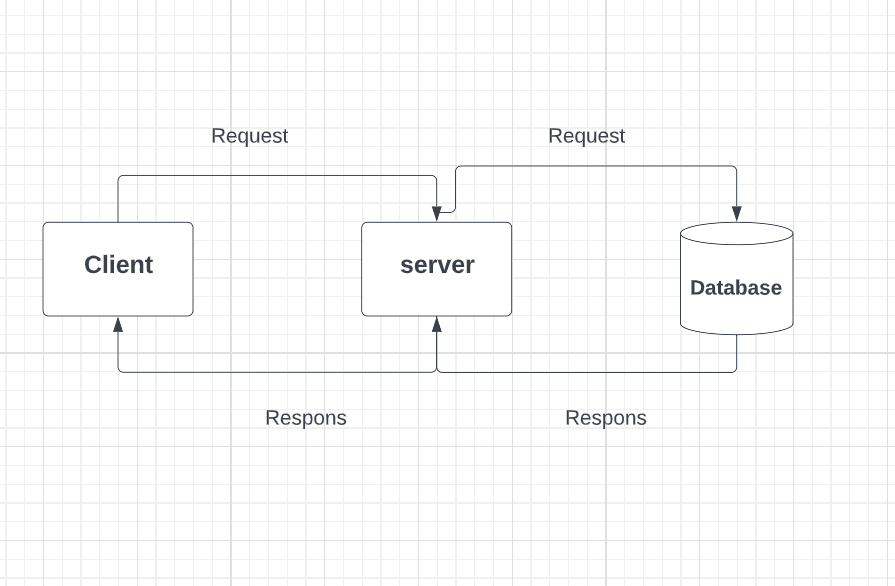
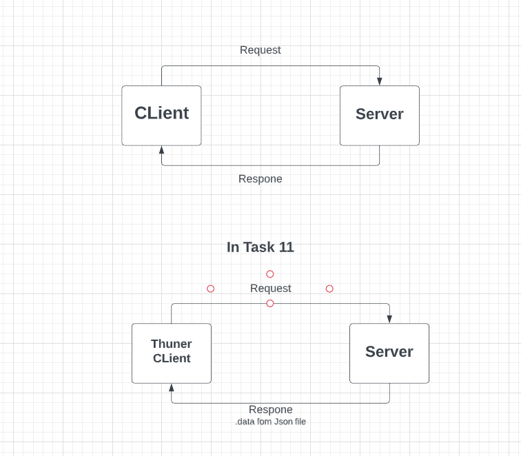

# Movies-Library - Project 04

**mohmmad**

# Task14
## WRRC

## Overview

## Getting Started

1. Created a new branch called Task14.

2. create an update request to update my comments for a specific movie in the database with path "/UPDATE/id".

3.  create a delete request to remove a specific movie from my database with path "/DELETE/id".

4.  Create a get request to get a specific movie from the database with path "getMovie/id".

## Project Features
<!-- What are the features included in you app -->

 

### What observations or questions do you have about what you’ve learned so far?
i need more time for study Lessons taken

### How long did it take you to complete this assignment? And, before you started, how long did you think it would take you to complete this assignment?
4 day

 

# Movies-Library - Project 03

**mohmmad**

# Task13
## WRRC

## Overview

## Getting Started

1. Created a new branch called Task13

2.  Setup my database environment.

3. In Postgres Database  Created a new database called "movie_db".

4. In VS Created a file called "schema.sql" and inside it created a tabel called "movie_tab".

5. Connecting the database with the table.

6. Install the required packages:"npm install pg" and  .

7. create a new client instance and connect to my database.

8. create a post request to save a specific movie to database .

9. Create a get request to get all the data from the database

## Project Features
<!-- What are the features included in you app -->

 

### What observations or questions do you have about what you’ve learned so far?
i need more time for study Lessons taken

### How long did it take you to complete this assignment? And, before you started, how long did you think it would take you to complete this assignment?
2 day

 

# Movies-Library - Project 02

**mohmmad**

# Task12
## WRRC

## Overview

## Getting Started

1. Created a new branch called Task12

2.  Install axios dotenv packages.

3.  Created new account on The Movie Database API and git my api key.

4. Created GET request to the 3rd party API for "/trending" path.

5. Created GET request to the 3rd party API for "/serch" path to Search for a movie name to get its information.

6. Created GET request to the 3rd party API for "/id" path to get the external ids for a movie.

7. Created GET request to the 3rd party API for "/image" path to get the images that belong to a movie.

8. Created GET request to the 3rd party API for "/similar" path to Get a list of similar movies.

## Project Features
<!-- What are the features included in you app -->

 

### What observations or questions do you have about what you’ve learned so far?
i need more time for study Lessons taken

### How long did it take you to complete this assignment? And, before you started, how long did you think it would take you to complete this assignment?
7 hours

 

# Movies-Library - Project 01

**mohmmad**

# Task11
## WRRC

## Overview

## Getting Started
1. Created a repository called Movies-Library on  my GitHub

2. Initialized "npm init -y" packeage

3. Created a new branch called Task11

4. Created basic file structure (server.js, .gitignore, .eslintrc.json )

5.  Initialized express packeage

6. Builded Home page  with a method of get and a path of "/" to  provided specific JSON data .

7. Builded Favorite page  with a method of get and a path of "/favorite" to response "Welcome to Favorite Page".

8. Builded Handel errors (staus 500 +staus 404)

9.  Builded Handel Listener  order to ensure that the server is turned on

## Project Features
<!-- What are the features included in you app -->

 

### What observations or questions do you have about what you’ve learned so far?
i need more time for study Lessons taken

### How long did it take you to complete this assignment? And, before you started, how long did you think it would take you to complete this assignment?
14 hours

 